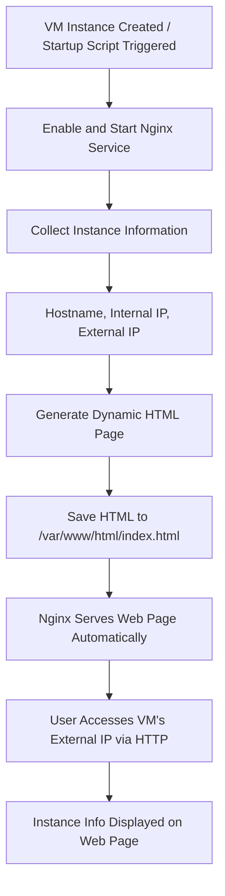

# 1. Project goal
The goal of this project is to create and manage a Virtual Machine (VM) infrastructure on Google Cloud Platform (GCP) using Google Compute Engine. The project involves automating the VM configuration with a startup script that installs an Nginx web server, generates a simple HTML page displaying instance information, and ensures the service starts automatically.

Additionally, the project includes a full lifecycle of cloud resource management and configuration tasks:

- Creation of a new GCP project for Group 6.
- Display and link the billing account to the project.
- Enable required APIs for Compute Engine and related services.
- Create and verify an instance template with the startup script.
- Deploy a managed instance group (MIG) based on the template.
- Verify group creation and test the startup script functionality across instances.
- Set up firewall rules to allow HTTP traffic.
- Enable Cloud Monitoring and Logging for performance and activity tracking.
- Review and manage IAM policies, including assigning and removing roles for specific users.
- Clean up resources by deleting the Managed Instance Group and Instance Template after testing.

Tools & Technologies:
- Google Compute Engine
- IAM
- Cloud Monitoring
- Bash
- Nginx
- gcloud CLI

# 2. Startup script
The startup script automates the deployment and configuration of each virtual machine instance. Upon creation, it installs Nginx, retrieves the VM’s hostname, internal IP, and external IP, and generates a dynamic HTML page displaying this information. As a result, every new VM is fully configured, operational, and immediately serves a personalized status page through its Nginx web server.

Startup scrip:
- Updates the system and installs necessary packages (nginx and curl).
- Starts and enables the Nginx service so it runs on boot.
- Collects instance details — hostname, internal IP, and external IP.
- Generates a custom HTML page showing those details.
- Makes the page immediately available via the Nginx default web server.


```
#!/bin/bash

# Update the system and install Nginx
apt update -y
apt install -y nginx curl

# Enable and start the Nginx service
systemctl enable nginx
systemctl start nginx
chmod -R 755 /var/www/html

# Generate an HTML page with instance information
HOSTNAME=$(hostname)
INTERNAL_IP=$(hostname -I | awk '{print $1}')
EXTERNAL_IP=$(curl -s ifconfig.me || echo "Brak publicznego IP")

# Strona HTML z informacjami o instancji
cat <<EOF > /var/www/html/index.html
<!DOCTYPE html>
<html>
<head>
  <meta charset="UTF-8">
  <title>Serwer: $HOSTNAME</title>
  <style>
    body { font-family: Arial; background-color: #f7f7f7; text-align: center; padding-top: 5%; }
    h1 { color: #333; }
    table { margin: 0 auto; border-collapse: collapse; background: #fff; box-shadow: 0 0 10px rgba(0,0,0,0.1); }
    td, th { padding: 10px 20px; border: 1px solid #ccc; }
    th { background-color: #f0f0f0; }
  </style>
</head>
<body>
  <h1>Grupa 6 - Automated VM Deployment with Startup Scripts</h1>
  <p>Dane tej instancji:</p>
  <table>
    <tr><th>Nazwa hosta</th><td>$HOSTNAME</td></tr>
    <tr><th>Adres wewnętrzny</th><td>$INTERNAL_IP</td></tr>
    <tr><th>Adres zewnętrzny</th><td>$EXTERNAL_IP</td></tr>
  </table>
</body>
</html>
EOF
```

### Startup Script Workflow




# 3. Deployment via CLI
The following steps show how to deploy and manage the virtual machine infrastructure using Google Cloud CLI.
This process automates project setup, resource creation, and lifecycle management directly from the command line - including creating an instance template with the startup script, deploying a managed instance group (MIG), configuring networking, enabling monitoring, and managing IAM roles.

The commands below can be executed sequentially in Google Cloud Shell or any environment with the gcloud CLI configured and authenticated.

### 1. Creation of a new GCP project for Group 6
```
gcloud projects create projekt-grupowy-grupa-6 \
  --name="Grupa 6 Deployment Project" \
  --set-as-default
```
### 2. Link the project to a billing account
First, list available billing accounts:
```
gcloud billing accounts list
```

### 3. Copy the ACCOUNT_ID from the previous command and paste it below:
```
gcloud billing projects link projekt-grupowy-grupa-6 \
  --billing-account=ACCOUNT_ID
```

### 4. Enable the Compute Engine API
```
gcloud services enable compute.googleapis.com
```

### 5. Upload the startup script file startup-script.sh to CLI

### 6. Create an instance template with the startup script
```
gcloud compute instance-templates create instance-template-group6 \
  --machine-type=e2-micro \
  --network-interface=network=default,network-tier=PREMIUM \
  --instance-template-region=us-central1 \
  --tags=http-server,monitoring \
  --metadata-from-file=startup-script=startup-script.sh
```

### 6a. Verify that the instance template was created
```
gcloud compute instance-templates list --regions=us-central1
```

### 7. Create Health Check
```
gcloud compute health-checks create http global-http-health-check \
    --port=80 \
    --check-interval=10 \
    --timeout=5 \
    --unhealthy-threshold=3 \
    --healthy-threshold=2
```

### 7a. Verify if Health Check was created successfully
```
gcloud compute health-checks list
gcloud compute health-checks describe global-http-health-check
```
### 8. Create a Managed Instance Group with 4 virtual machines
```
gcloud beta compute instance-groups managed create instance-group-1 \
  --project=projekt-grupowy-grupa-6 \
  --base-instance-name=instance-group-1 \
  --template=projects/projekt-grupowy-grupa-6/regions/us-central1/instanceTemplates/instance-template-group6 \
  --size=4 \
  --zones=us-central1-c,us-central1-f,us-central1-b
  --health-check=projects/projekt-grupowy-grupa-6/regions/us-central1/healthChecks/global-http-health-check
```

### 8a. Check if the instance group was created successfully
```
gcloud compute instance-groups managed list
```

### 9. Create Load Balancer

Create a backend service and attach the health check
```
gcloud compute backend-services create backend-service-group6 \
  --protocol=HTTP \
  --health-checks=global-http-health-check \
  --global
```

Add your managed instance group as a backend
```
gcloud compute backend-services add-backend backend-service-group6 \
  --instance-group=instance-group-1 \
  --instance-group-region=us-central1 \
  --global
```

Create a URL map to route requests to the backend service
```
gcloud compute url-maps create url-map-group6 \
  --default-service=backend-service-group6
```

Create a target HTTP proxy
```
gcloud compute target-http-proxies create http-proxy-group6 \
  --url-map=url-map-group6
```

Create a forwarding rule to assign external IP
```
gcloud compute forwarding-rules create http-forwarding-rule-group6 \
  --global \
  --target-http-proxy=http-proxy-group6 \
  --ports=80
```

### 10. Verify the load balancer configuration

Check backend service status
```
gcloud compute backend-services describe backend-service-group6 --global
```

Check backend health
```
gcloud compute backend-services get-health backend-service-group6 --global
```

### 11. Create a firewall rule to allow HTTP traffic

Allows incoming HTTP traffic (port 80) so external users can access the web application hosted on the VM or instance group.
```
gcloud compute firewall-rules create allow-http \
  --network=default \
  --allow=tcp:80 \
  --target-tags=http-server \
  --description="Allow incoming HTTP traffic"
```

Allows incoming HTTPS traffic (port 443) so users can securely access the web application over an encrypted connection.
```
gcloud compute firewall-rules create allow-https \
  --network=default \
  --allow=tcp:443 \
  --target-tags=http-server \
  --description="Allow incoming HTTPS traffic"
```

Allows incoming SSH traffic (port 22) so administrators can securely connect to the virtual machine for maintenance and troubleshooting.
```
gcloud compute firewall-rules create allow-ssh \
  --network=default \
  --allow=tcp:22 \
  --target-tags=http-server \
  --description="Allow SSH access for admin/debug"
```

Allows incoming ICMP traffic so network tools like ping and traceroute can verify connectivity and diagnose network issues.
```
gcloud compute firewall-rules create allow-icmp \
  --network=default \
  --allow=icmp \
  --description="Allow ICMP (ping/traceroute) for diagnostics"
```

Monitoring.
```
gcloud compute firewall-rules create allow-monitoring \
  --network=default \
  --allow=tcp:9090,tcp:3000 \
  --source-ranges=35.199.192.0/19 \
  --target-tags=monitoring \
  --description="Allow access to monitoring tools from GCP"
```

Blocks any traffic not specified in allow rules.
```
gcloud compute firewall-rules create deny-all-ingress \
  --network=default \
  --direction=INGRESS \
  --priority=65535 \
  --action=DENY \
  --rules=all \
  --description="Deny all other ingress traffic for security"
```

### 12. Enable Cloud Monitoring and Logging services
```
gcloud services enable monitoring.googleapis.com logging.googleapis.com
```

### 13. Check startup script logs for each VM instance
```
gcloud compute instances get-serial-port-output instance-group-1-wv5t \
  --zone=us-central1-b

gcloud compute instances get-serial-port-output instance-group-1-q52h \
  --zone=us-central1-c

gcloud compute instances get-serial-port-output instance-group-1-4rz9 \
  --zone=us-central1-f

gcloud compute instances get-serial-port-output instance-group-1-jzb6 \
  --zone=us-central1-f
```

### 14. Display the current IAM policy for the project
```
gcloud projects get-iam-policy projekt-grupowy-grupa-6
```

### 15. Add IAM role to a user
```
gcloud projects add-iam-policy-binding projekt-grupowy-grupa-6 \
  --member="user:adres@email.com" \
  --role="roles/editor"
```

### 16. Remove IAM role from a user
```
gcloud projects remove-iam-policy-binding projekt-grupowy-grupa-6 \
  --member="user:adres@email.com" \
  --role="roles/editor"
```

### 17. Optional: Clean up resources created during the project
```
gcloud compute instance-groups managed delete instance-group-1 --zone=us-central1-c gcloud compute instance-groups managed delete instance-group-1 \
  --region=us-central1
gcloud compute instance-templates delete instance-template-group6 \
  --region=us-central1

gcloud compute firewall-rules delete allow-http
```

# 4. Testing

### Test Case 1 - Create a new project
Step 1: Use create project command


Since the project ID works exactly the same way as a login name, we need to choose a different PROJECT_ID.

Step 2 Run command again, with unique project_id


Success / conclusion:


Should be changed to:


Step 3 Verify the project was created and is set as default


Status: PASSED

### Test Case 2 - Connect with billing account

Step 1 List available billing accounts


Step 2 Connect the project with selected billing account


Step 3 Check that billing is enabled


The output shows “billingEnabled”: true
Status: PASSED

### Test Case 3 - Enable the Compute Engine API

Step 1 Enable the Compute Engine API using the following command


Step 2 Verify that the API is enabled


The Compute Engine API (compute.googleapis.com) appears on the list of enabled services.

Status: PASSED

### Test Case 4 - Delete Instance From MIG
Verify that deleting an instance from a Managed Instance Group (MIG) triggers automatic recreation of the instance by the group’s autoscaling and health management mechanisms.

Step 1 List existing instances in the MIG


Step 2 Delete one instance from the group


Step 3 Verify automatic recreation


MIG automatically created new instance (action: creating)

Status: PASSED

### Test Case 5 - Broken Startup Script
Verify how a MIG behaves when instances are recreated using a template with broken startup script, check health

Step 1 Modify startup script


Step 2 Create a new template based on broken script


Step 3 Set broken template as current MIG template


Step 4 Recreate instances in the MIG


Step 5 Verify that recreated instances use broken template
```
gcloud compute backend-services get-health backend-service-group6 --global
```


Step 6 Monitor health check status (using existing health check) 


Instances with broken script show actions verifying and recreating in loop based on HC status which is not healthy

Status: PASSED / Need Observation

### Test Case 6 - Deleted allow-http rule
Verify behaviour when the allow-http rule is deleted

Step 1 Verify if allow-http rule exists


Step 2 Delete this rule


Step 3 Check external IP of instances


Step 4 Test http access using curl, connection fails


Step 5 Recreate allow-http firewall rule


Step 6 Test http access again, connection succeeds, traffic restored


Status: PASSED

### Test Case 7 - LB routes traffic to different VMs

Verify behaviour when pinging LB IP address constantly

Step 1 Generate traffic to LB IP address


Step 2 Verify if traffic is being load balanced across multiple VM instances.


Status: PASSED

### Test Case 8 - Autohealing works

Verify behaviour when health check detects unhealthy vm instance

Step 1 Connect to one of the VM instances in the MIG


Step 2 Simulate application failure by turning off nginx


Step 3 Verify connection using external IP address of selected instance


Step 4 Verify that health status is unhealthy of one instance in backend service


Step 5 Verify that after some time VM instance is removed


Step 6 Verify that the unhealthy VM instance was automatically recreated using the original instance template.


Status: PASSED

# 5. Authors
- **Group 6 Members:**
  - [@dfbsx](https://github.com/dfbsx)
  - [@arisusaktos](https://github.com/arisaktos)
  - [@Magdalena-N](https://github.com/Magdalena-N)
  - DF
  - JD
